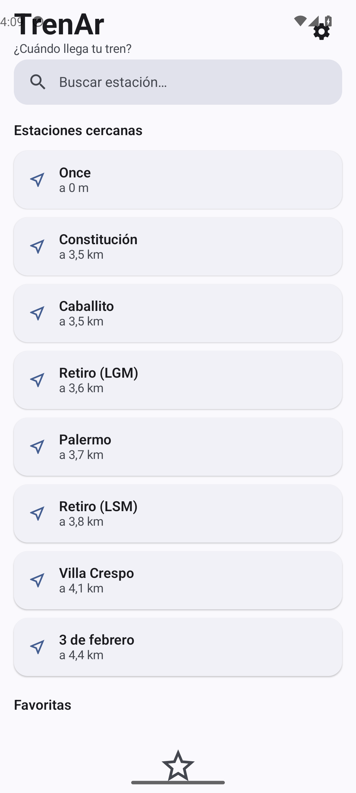
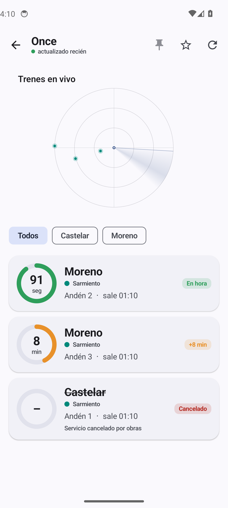

# 🚆 TrenAr — ¿Cuándo llega tu tren?

App Android nativa para los trenes de **Trenes Argentinos (SOFSE)**: arribos en vivo, demoras, estaciones cercanas por GPS, favoritas, notificaciones y un radar de trenes en tiempo real.

> App **no oficial**, sin fines comerciales. Usa la API de Trenes Argentinos (SOFSE). Los horarios pueden variar; verificá siempre en el andén.

## ✨ Características

- ⏱️ **¿Cuándo llega?** — anillo de cuenta regresiva que corre segundo a segundo, con resync automático.
- 🚦 **Demoras y cancelaciones** — cálculo de demora real (programado vs. estimado) con estado *En hora / +min / Cancelado*.
- 📍 **Estaciones cercanas por GPS** — catálogo offline de ~262 estaciones ordenadas por distancia.
- ⭐ **Favoritas** — marcá tus estaciones y tenelas siempre a mano.
- 🔔 **Notificaciones** — avisos en segundo plano por demoras graves y cancelaciones de tus favoritas (WorkManager).
- 🛰️ **Radar de trenes en vivo** — dibuja la posición GPS real de cada formación alrededor de la estación (sin API key de mapas).
- 📌 **Widget** de pantalla de inicio con los próximos trenes de tu estación fijada.
- 🎨 **Material 3** con color dinámico y modo oscuro.

## 📸 Capturas

| Estaciones cercanas | Arribos en vivo |
|---|---|
|  |  |

*(Los arribos de la captura son de muestra, tomados fuera del horario de servicio.)*

## 🛠️ Stack

- **Kotlin** + **Jetpack Compose** (Material 3), arquitectura MVVM.
- **Retrofit** + **OkHttp** + **kotlinx.serialization** contra la API oficial.
- **DataStore** (favoritos/preferencias), **WorkManager** (notificaciones), **Play Services Location** (GPS).
- DI manual (`ServiceLocator`), sin anotaciones/kapt.
- `compileSdk 34`, `minSdk 26`.

## 🔌 Sobre la API

La app habla con la interfaz interna de SOFSE (`api-servicios.sofse.gob.ar/v1`), la misma que usa la app oficial. El login JWT se regenera solo en el dispositivo usando la **fecha local de Argentina** (detalle que la app oficial resuelve con UTC y falla cerca de la medianoche). Si SOFSE cambia el esquema, hay que actualizar `data/remote/`.

## 🚀 Compilar

```bash
./gradlew assembleDebug
```

El APK queda en `app/build/outputs/apk/debug/app-debug.apk`. Requiere JDK 17 y el Android SDK (plataforma 34, build-tools 34).

## 👥 Créditos

- **Idea y dirección:** Lucas De Renzo
- **Desarrollo:** Claude (Opus) — Anthropic

Hecho en equipo, humano + IA. 🚆
